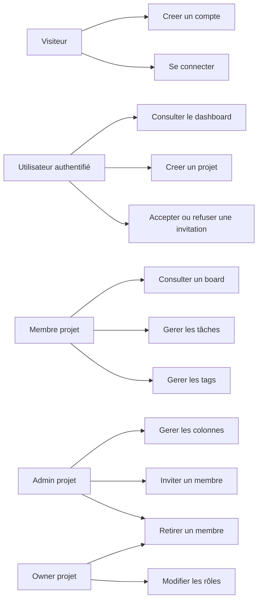
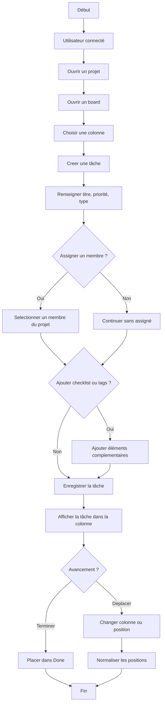
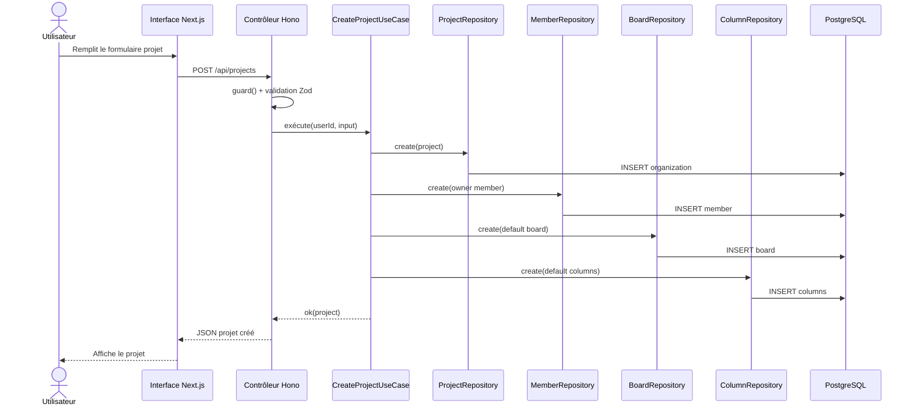
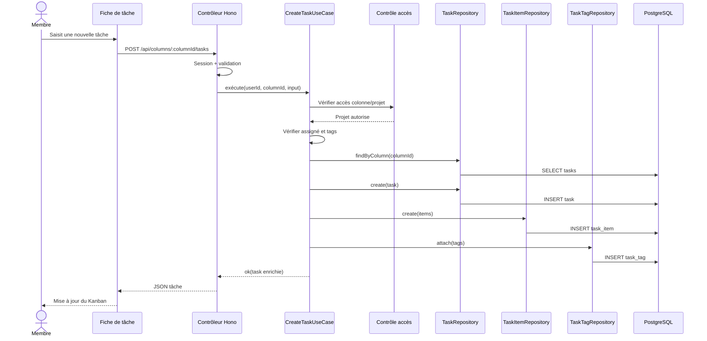
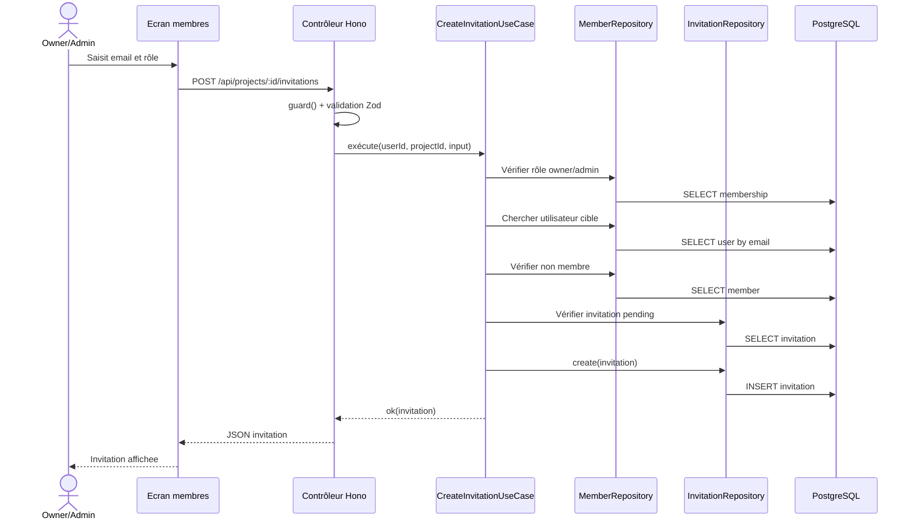
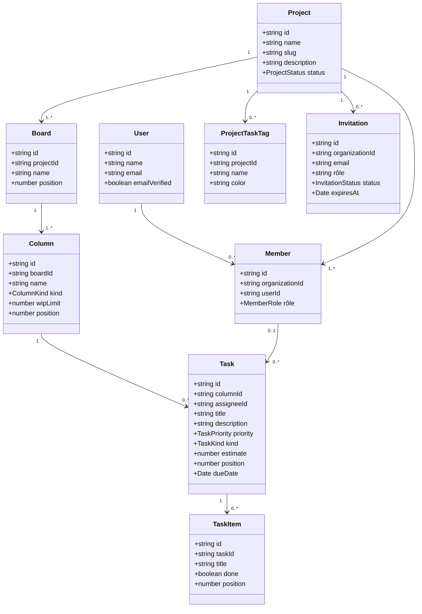
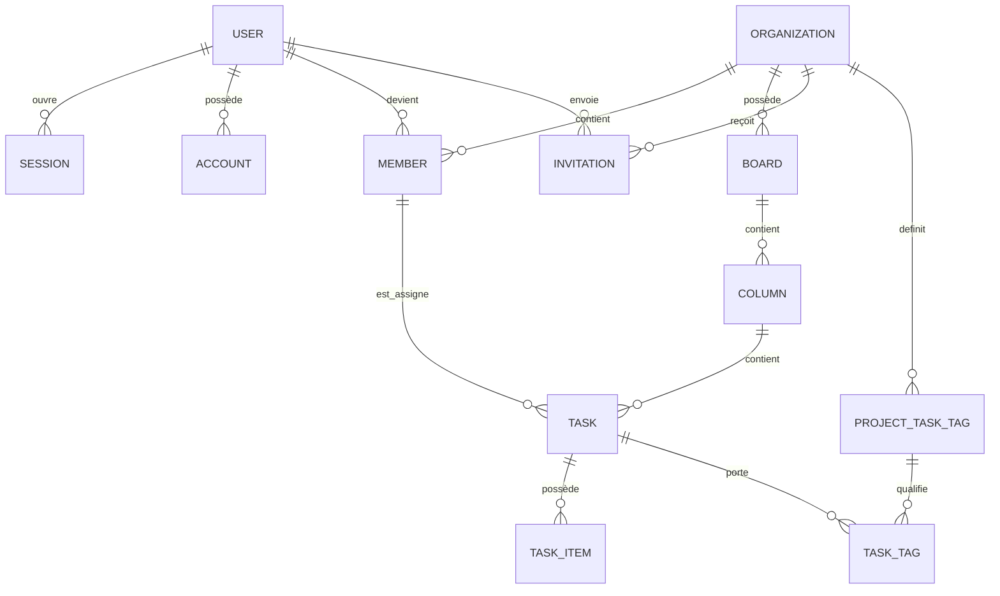
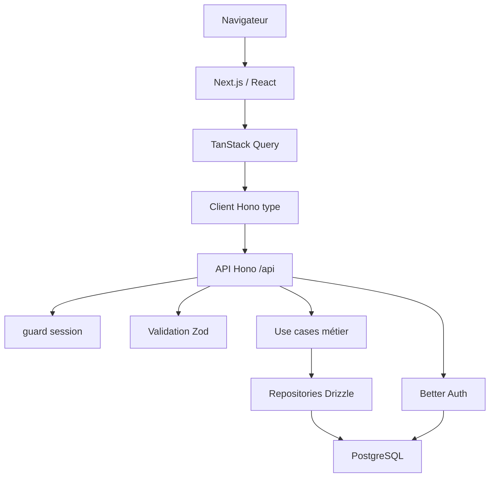

# Dossier Projet - OpenSprint

Titre professionnel visé : Concepteur Développeur d'Applications

Projet : OpenSprint

Candidat : Martin Dinahet

Session : CDA05 2026

Date : 26 mai 2026

Période de réalisation : janvier à juin 2026

URL publique : https://opensprint-app.vercel.app

Dépôt GitHub : https://github.com/martin-dinahet/opensprint

## Sommaire

1. Introduction
2. Présentation du projet
3. Expression du besoin
4. Objectifs et périmètre
5. Gestion de projet
6. Spécifications fonctionnelles
7. Conception de l'interface
8. Modélisation UML
9. Modélisation Merise et base de données
10. Architecture logicielle
11. Réalisation technique
12. Sécurité de l'application
13. Tests et qualité
14. Intégration continue et déploiement
15. Veille technologique
16. Difficultés rencontrées et solutions
17. Évolutions futures
18. Conclusion
19. Annexes

## 1. Introduction

Ce dossier présente le projet OpenSprint, réalisé dans le cadre de la préparation au titre professionnel Concepteur Développeur d'Applications.

OpenSprint est une application web collaborative de gestion de projet agile. Elle permet à des utilisateurs authentifiés de créer des projets, d'organiser le travail sous forme de tableaux Kanban, de gérer des tâches, des membres, des rôles et des invitations.

Le projet met en œuvre une application sécurisée, organisée en couches, avec une interface frontend moderne, une API backend, une base de données relationnelle PostgreSQL, une stratégie de tests et une intégration continue.

Le dossier présente la démarche suivie, les choix fonctionnels et techniques, les modélisations, les extraits de conception et les éléments de qualité permettant d'évaluer les compétences du titre CDA.

## 2. Présentation du projet

### 2.1 Nom et nature du projet

Nom : OpenSprint

Nature : application web de pilotage de projets et de tâches.

Cadre de réalisation : projet personnel réalisé entre janvier et juin 2026.

L'entreprise dans laquelle le candidat effectue son stage de six mois, du 5 janvier 2026 au 5 juillet 2026, constitue un utilisateur potentiel de l'application. Elle apporte des retours utilisateur permettant d'améliorer progressivement l'ergonomie, les fonctionnalités et la cohérence du projet avec des besoins professionnels réels.

OpenSprint se positionne comme un espace de travail permettant de centraliser le suivi d'un projet. L'application reprend les principes d'un tableau Kanban : les tâches progressent entre plusieurs colonnes représentant leur état d'avancement.

L'application est pensée pour une équipe projet qui souhaite suivre :

- les projets en cours ;
- les tableaux associés à chaque projet ;
- les colonnes de workflow ;
- les tâches et leurs priorités ;
- les personnes assignées ;
- les checklists internes aux tâches ;
- les tags de catégorisation ;
- les membres et leurs droits d'accès.

### 2.2 Problème identifié

Dans un contexte de projet, les informations de suivi peuvent rapidement devenir difficiles à maintenir si elles sont dispersées entre plusieurs supports : messages, fichiers texte, tableurs, outils non synchronisés ou tableaux informels.

Cette dispersion génère plusieurs problèmes :

- perte de visibilité sur l'avancement réel ;
- difficulté à identifier les responsabilités ;
- absence de priorisation claire ;
- manque de traçabilité sur les tâches ;
- gestion manuelle des accès et des rôles ;
- risque de confusion entre les projets.

OpenSprint répond à ces problématiques en fournissant une application centralisée, sécurisée et organisée autour de projets collaboratifs.

### 2.3 Utilisateurs cibles

Les utilisateurs cibles sont :

- un chef de projet qui souhaite suivre l'avancement global ;
- un responsable d'équipe qui veut organiser le travail ;
- un développeur ou contributeur qui doit consulter et mettre à jour ses tâches ;
- un administrateur de projet qui gere les membres et les invitations ;
- un utilisateur invite qui rejoint un projet existant.

### 2.4 Personas

Persona 1 : responsable de projet

- Nom fictif : Camille
- Profil : cheffe de projet dans une petite équipe produit
- Besoin : visualiser rapidement les projets, les tâches ouvertes et les responsabilités
- Attentes : interface claire, suivi des membres, priorités visibles, accès sécurisé

Persona 2 : membre d'équipe

- Nom fictif : Lucas
- Profil : développeur frontend
- Besoin : consulter les tâches qui lui sont assignées et les faire avancer dans le Kanban
- Attentes : création rapide de tâches, déplacement fluide, checklist et tags

Persona 3 : administratrice de projet

- Nom fictif : Sarah
- Profil : responsable opérationnelle
- Besoin : inviter des membres, modifier les droits et surveiller l'organisation du projet
- Attentes : gestion simple des rôles, prevention des erreurs, accès restreint aux actions sensibles

## 3. Expression du besoin

### 3.1 Besoin general

Le besoin principal est de disposer d'une application web permettant à une équipe de gérer ses projets et ses tâches dans un espace centralisé et sécurisé.

L'application doit permettre :

- la création d'un compte utilisateur ;
- la connexion sécurisée ;
- la création d'un projet ;
- la création automatique d'un tableau de travail ;
- la gestion de colonnes Kanban ;
- la création et le suivi des tâches ;
- l'assignation des tâches aux membres ;
- l'invitation de membres dans un projet ;
- la gestion des rôles ;
- la protection des données par authentification et autorisation.

### 3.2 Besoins fonctionnels principaux

Authentification :

- un visiteur peut créer un compte ;
- un utilisateur peut se connecter ;
- les pages de travail sont inaccessibles sans session active.

Projets :

- un utilisateur connecté peut créer un projet ;
- un projet possède un nom, une description et un statut ;
- un projet peut être actif, en pause ou archivé ;
- un utilisateur voit uniquement les projets dont il est membre.

Tableaux :

- chaque projet contient un ou plusieurs tableaux ;
- un tableau par défaut est créé à la création du projet ;
- un tableau contient des colonnes ordonnées.

Colonnes :

- les colonnes représentent les étapes du workflow ;
- certaines colonnes ont une limite WIP ;
- les colonnes peuvent être créées, modifiées, supprimées et réordonnées.

Tâches :

- une tâche appartient à une colonne ;
- une tâche possède un titre, une description, une priorité, un type, une estimation et une échéance optionnelle ;
- une tâche peut être assignée à un membre ;
- une tâche peut contenir une checklist ;
- une tâche peut être associée à des tags ;
- une tâche peut être déplacée entre colonnes.

Membres :

- un projet contient des membres ;
- les membres ont un rôle ;
- le créateur du projet devient owner ;
- les owner/admin peuvent inviter des membres ;
- seul l'owner peut modifier les rôles.

Invitations :

- une invitation cible un utilisateur existant par email ;
- une invitation à un statut ;
- une invitation expire après sept jours ;
- un utilisateur peut accepter ou refuser une invitation.

### 3.3 Besoins non fonctionnels

Sécurité :

- authentification obligatoire sur les espaces projet ;
- contrôle d'accès côté serveur ;
- validation des données entrantes ;
- protection des actions sensibles par rôle ;
- absence de secrets en clair dans le code.

Ergonomie :

- interface responsive ;
- navigation simple entre dashboard, projet, tableau et membres ;
- feedback utilisateur lors des actions ;
- formulaires avec validation et messages d'erreur.

Maintenabilité :

- architecture en couches ;
- séparation frontend/backend ;
- séparation contrôleurs, cas d'utilisation et repositories ;
- schéma de base versionné par migrations ;
- tests frontend et backend.

Qualité :

- lint et formatage avec Biome ;
- typecheck TypeScript ;
- tests automatisés ;
- intégration continue.

## 4. Objectifs et périmètre

### 4.1 Objectifs du projet

Les objectifs du projet sont :

- concevoir une application de gestion de projet collaborative ;
- mettre en place une interface utilisateur moderne et responsive ;
- implémenter une API sécurisée ;
- modeliser une base de données relationnelle cohérente ;
- appliquer des règles de droits entre owner, admin et member ;
- intégrer des tests frontend et backend ;
- automatiser les contrôles qualité via une CI.

### 4.2 Périmètre réalisé

Le périmètre réalisé comprend :

- landing page ;
- inscription ;
- connexion ;
- dashboard projet ;
- création et consultation de projets ;
- création automatique d'un board et de colonnes par defaut ;
- gestion multi-board ;
- affichage Kanban ;
- création et gestion de colonnes ;
- création, modification, suppression et déplacement de tâches ;
- checklist de tâches ;
- tags de tâches ;
- assignation de tâches ;
- gestion des membres ;
- invitations ;
- contrôle de rôles ;
- tests automatisés ;
- CI GitHub Actions.

### 4.3 Hors périmètre

Les éléments suivants ne font pas partie du périmètre actuel :

- messagerie temps réel ;
- notifications email réelles ;
- commentaires de tâches ;
- pièces jointes ;
- calendrier global ;
- exports PDF/CSV ;
- application mobile native ;
- intégration avec Jira, GitHub ou Slack ;
- monitoring de production avancé ;
- déploiement continu complet documenté dans le dépôt.

Ces éléments sont présentés comme évolutions futures possibles.

## 5. Gestion de projet

### 5.1 Méthode de travail

Le projet à été organisé de maniere itérative. Les fonctionnalites ont été construites par blocs :

1. mise en place du socle technique ;
2. authentification ;
3. gestion des projets ;
4. gestion des tableaux et colonnes ;
5. gestion des tâches ;
6. amélioration du Kanban ;
7. gestion des membres et invitations ;
8. tests et intégration continue ;
9. refactorisation et amélioration de l'interface.

Cette approche permet de livrer progressivement des increments fonctionnels et de valider chaque couche avant d'ajouter la suivante.

### 5.2 Historique Git

Le projet est versionne avec Git. L'historique montre plusieurs étapes significatives :

- ajout des workflows CI ;
- ajout de fonctionnalites de tâches avancées ;
- unification de la gestion des tâches dans une fiche ;
- ajout du header réactif ;
- refactorisation des entites ;
- ajout de l'interface multi-board ;
- renommage des colonnes Kanban ;
- refonte de l'interface ;
- ajout du systeme d'invitations ;
- refactorisation des composants frontend.

### 5.3 Priorisation fonctionnelle

Une priorisation de type MoSCoW peut être retenue pour présenter le projet.

Must have :

- authentification ;
- création de projets ;
- gestion du board Kanban ;
- création et déplacement des tâches ;
- contrôle d'accès par membre ;
- tests et CI.

Should have :

- invitations ;
- rôles owner/admin/member ;
- checklists ;
- tags ;
- limites WIP.

Could have :

- multi-board ;
- filtres et tri dashboard ;
- transfert de tâche entre projets.

Won't have pour cette version :

- temps réel ;
- notifications email ;
- exports ;
- pièces jointes.

## 6. Spécifications fonctionnelles

### 6.1 User stories

US-01 : En tant que visiteur, je veux créer un compte afin d'accéder à mon espace projet.

US-02 : En tant qu'utilisateur, je veux me connecter afin de retrouver mes projets.

US-03 : En tant qu'utilisateur connecté, je veux créer un projet afin de centraliser le suivi d'une équipe.

US-04 : En tant que membre, je veux consulter la liste de mes projets afin d'accéder rapidement au bon espace.

US-05 : En tant que membre, je veux consulter un board Kanban afin de visualiser l'avancement des tâches.

US-06 : En tant que membre, je veux créer une tâche afin de formaliser un travail à realiser.

US-07 : En tant que membre, je veux déplacer une tâche entre les colonnes afin de representer son avancement.

US-08 : En tant que membre, je veux ajouter une checklist à une tâche afin de découper le travail.

US-09 : En tant que membre, je veux assigner une tâche à un membre afin de clarifier la responsabilité.

US-10 : En tant qu'admin ou owner, je veux inviter un membre afin de collaborer sur un projet.

US-11 : En tant qu'utilisateur invite, je veux accepter ou refuser une invitation afin de contrôler mon accès au projet.

US-12 : En tant qu'owner, je veux modifier le rôle d'un membre afin d'adapter les permissions.

US-13 : En tant que membre, je veux filtrer et trier mes projets afin de retrouver rapidement un projet.

US-14 : En tant que membre, je veux utilisér des tags afin de catégoriser les tâches.

US-15 : En tant qu'équipe, nous voulons des limites WIP visibles afin d'identifiér la surcharge d'une colonne.

### 6.2 Règles métier

Règle 1 : un utilisateur doit être authentifié pour acceder aux projets.

Règle 2 : un utilisateur ne peut consulter que les projets dont il est membre.

Règle 3 : le créateur d'un projet devient automatiquement owner.

Règle 4 : un projet créé automatiquement un tableau par defaut.

Règle 5 : un tableau par defaut créé automatiquement quatre colonnes : Backlog, Active, Review, Done.

Règle 6 : les colonnes Active et Review possèdent des limites WIP par defaut.

Règle 7 : une tâche appartient toujours à une colonne.

Règle 8 : une tâche assignée doit être assignée à un membre du même projet.

Règle 9 : un tag associe à une tâche doit appartenir au même projet.

Règle 10 : une invitation ne peut être créée que par un owner ou un admin.

Règle 11 : un utilisateur déjà membre ne peut pas recevoir une nouvelle invitation pour le même projet.

Règle 12 : une invitation pending est unique pour un couple projet/email.

Règle 13 : une invitation expire après sept jours.

Règle 14 : seul l'owner peut modifier le rôle d'un membre.

Règle 15 : le rôle owner ne peut pas être modifié par l'écran de gestion des membres.

### 6.3 Parcours utilisateur principal

Parcours : création et pilotage d'un projet

1. L'utilisateur créé un compte.
2. Il se connecté.
3. Il arrive sur le dashboard.
4. Il créé un projet avec un nom, une description et un nom de tableau.
5. L'application créé le projet, son board et ses colonnes.
6. L'utilisateur ouvre le board Kanban.
7. Il créé une tâche.
8. Il ajoute une priorité, une description, une checklist et des tags.
9. Il deplace la tâche entre les colonnes.
10. Il invite un membre.
11. Le membre accepte l'invitation.
12. L'owner ou l'admin assigné une tâche au membre.

## 7. Conception de l'interface

### 7.1 Structure des pages

Les principales pages de l'application sont :

- `/` : page d'accueil ;
- `/sign-up` : création de compte ;
- `/sign-in` : connexion ;
- `/dashboard` : liste des projets ;
- `/projects/:id` : redirection vers le tableau par defaut ;
- `/projects/:id/boards/:boardId` : board Kanban ;
- `/projects/:id/members` : gestion des membres et invitations ;
- `/account` : espace compte.

### 7.2 Dashboard

Le dashboard permet :

- d'afficher les projets accessibles ;
- de créer un nouveau projet ;
- de rechercher un projet ;
- de filtrer par statut ;
- de trier par date ou nom ;
- de consulter le nombre de membres et de tâches ouvertes.

### 7.3 Board Kanban

Le board Kanban affiche :

- les colonnes du tableau ;
- les tâches de chaque colonne ;
- les métriques du board ;
- les alertes de limite WIP ;
- un bouton d'ajout de colonne ;
- une fiche de tâche pour créer ou modifier une tâche.

### 7.4 Gestion des membres

L'écran membres permet :

- de consulter les membres ;
- de voir les rôles ;
- de modifier les rôles si l'utilisateur courant est owner ;
- de retirer un membre si l'utilisateur courant à les droits ;
- d'inviter un membre ;
- de consulter les invitations en attente ;
- d'annuler une invitation.

### 7.5 Ergonomie et accessibilite

L'application utilisé :

- des composants UI réutilisables ;
- des icones pour les actions ;
- des labels dans les formulaires ;
- des messages d'erreur ;
- des états de chargement ;
- des toasts pour le retour utilisateur ;
- une interface responsive ;
- une navigation laterale pour les pages authentifiees.

Des captures d'écran devront être ajoutées dans les annexes :

- page d'accueil ;
- formulaire de connexion ;
- dashboard ;
- création de projet ;
- board Kanban ;
- fiche de tâche ;
- gestion des membres ;
- invitations.

## 8. Modélisation UML

### 8.1 Diagramme de cas d'utilisation



### 8.2 Diagramme d'activite : création et suivi d'une tâche



### 8.3 Diagramme de sequence : création d'un projet



### 8.4 Diagramme de sequence : création d'une tâche



### 8.5 Diagramme de sequence : invitation d'un membre



### 8.6 Diagramme de classes simplifie



## 9. Modélisation Merise et base de données

### 9.1 Entites principales

UTILISATEUR :

- id ;
- nom ;
- email ;
- email vérifie ;
- image ;
- dates de création et modification.

PROJET :

- id ;
- nom ;
- slug ;
- description ;
- statut ;
- dates de création et modification.

MEMBRE :

- id ;
- projet ;
- utilisateur ;
- rôle ;
- date d'ajout.

TABLEAU :

- id ;
- projet ;
- nom ;
- position ;
- dates de création et modification.

COLONNE :

- id ;
- tableau ;
- nom ;
- type ;
- limite WIP ;
- position ;
- dates de création et modification.

TACHE :

- id ;
- colonne ;
- membre assigné ;
- titre ;
- description ;
- priorité ;
- type ;
- estimation ;
- position ;
- échéance ;
- dates de création et modification.

ELEMENT_CHECKLIST :

- id ;
- tâche ;
- titre ;
- statut fait/non fait ;
- position ;
- dates de création et modification.

TAG_PROJET :

- id ;
- projet ;
- nom ;
- couleur ;
- dates de création et modification.

INVITATION :

- id ;
- projet ;
- email ;
- rôle ;
- statut ;
- invitant ;
- expiration ;
- date de création.

### 9.2 Cardinalites

- Un utilisateur peut être membre de zéro à plusieurs projets.
- Un projet possède un ou plusieurs membres.
- Un projet possède un ou plusieurs tableaux.
- Un tableau appartient à un seul projet.
- Un tableau possède une ou plusieurs colonnes.
- Une colonne appartient à un seul tableau.
- Une colonne contient zéro à plusieurs tâches.
- Une tâche appartient à une seule colonne.
- Une tâche peut être assignée à zéro ou un membre.
- Un membre peut avoir zéro à plusieurs tâches assignées.
- Une tâche possède zéro à plusieurs éléments de checklist.
- Un projet definit zéro à plusieurs tags.
- Une tâche peut possèder zéro à plusieurs tags.
- Un tag peut être utilisé par zéro à plusieurs tâches.
- Un projet peut recevoir zéro à plusieurs invitations.
- Une invitation concerne un seul projet.
- Une invitation est envoyée par un seul utilisateur.

### 9.3 MCD



### 9.4 MLD simplifie

USER(id, name, email, email_vérified, image, created_at, updated_at)

SESSION(id, expires_at, token, created_at, updated_at, ip_address, user_agent, user_id, active_organization_id)

ACCOUNT(id, account_id, provider_id, user_id, access_token, refresh_token, id_token, password, created_at, updated_at)

ORGANIZATION(id, name, slug, logo, metadata, description, status, created_at, updated_at)

MEMBER(id, organization_id, user_id, rôle, created_at)

BOARD(id, project_id, name, position, created_at, updated_at)

COLUMN(id, board_id, name, kind, wip_limit, position, created_at, updated_at)

TASK(id, column_id, assignee_id, title, description, priority, kind, estimate, position, due_date, created_at, updated_at)

TASK_ITEM(id, task_id, title, done, position, created_at, updated_at)

PROJECT_TASK_TAG(id, project_id, name, color, created_at, updated_at)

TASK_TAG(task_id, tag_id)

INVITATION(id, organization_id, email, rôle, status, inviter_id, expires_at, created_at)

VERIFICATION(id, identifiér, value, expires_at, created_at, updated_at)

### 9.5 MPD et contraintes

La base de données est implementee avec PostgreSQL et Drizzle ORM.

Contraintes importantes :

- clés primaires textuelles générées avec `nanoid()` ;
- email utilisateur unique ;
- slug projet unique ;
- suppression en cascade pour les entites dépendantes ;
- index sur les clés étrangères fréquemment utilisées ;
- enum PostgreSQL pour les statuts et types principaux ;
- clé primaire composée sur `task_tag(task_id, tag_id)` ;
- index unique partiel empêchant deux invitations pending pour le même email dans le même projet.

Enums :

- project_status : active, paused, archived ;
- column_kind : backlog, active, review, done, custom ;
- task_priority : low, medium, high, urgent ;
- task_kind : task, bug, feature, chore.

## 10. Architecture logicielle

### 10.1 Vue globale

OpenSprint est une application fullstack TypeScript basee sur Next.js et Hono.



### 10.2 Structure frontend

Le frontend suit une organisation proche du Feature-Sliced Design :

- `src/app` contient les routes Next.js ;
- `src/entities` contient les entités frontend, les hooks et les appels API ;
- `src/features` contient les workflows utilisateurs ;
- `src/widgets` contient les grandes zones d'interface ;
- `src/shared` contient les composants UI, helpers et clients partages.

Exemples :

- `src/features/create-project` : formulaire et logique de création de projet ;
- `src/features/manage-task` : fiche de création/edition de tâche ;
- `src/widgets/kanban-board` : affichage et interactions Kanban ;
- `src/entities/task` : types, API et hooks lies aux tâches.

### 10.3 Structure backend

Le backend est organisé en couches :

- contrôleurs Hono ;
- DTO Zod ;
- use cases ;
- repositories ;
- schémas Drizzle ;
- base PostgreSQL.

Cette séparation permet :

- de conserver les règles métier dans les use cases ;
- de limiter les contrôleurs au mapping HTTP ;
- de centraliser l'accès aux données dans les repositories ;
- de tester les comportements métier plus facilement.

### 10.4 Flux d'une requête API

1. L'utilisateur effectue une action dans l'interface.
2. Le hook frontend appelle l'API via le client Hono.
3. Le contrôleur Hono reçoit la requête.
4. `guard()` vérifie la session.
5. Zod valide le body JSON.
6. Le use case contrôle les règles métier.
7. Le repository exécute la requête en base.
8. Le use case renvoie `ok` ou `err`.
9. Le contrôleur transforme le resultat en réponse HTTP.
10. TanStack Query met à jour l'état côté client.

## 11. Réalisation technique

### 11.1 Technologies utilisées

Frontend :

- Next.js 16 ;
- React 19 ;
- TypeScript ;
- Tailwind CSS 4 ;
- TanStack Query ;
- dnd-kit ;
- Lucide React ;
- Tabler Icons ;
- composants shadcn-style.

Backend :

- Hono ;
- Better Auth ;
- Zod ;
- Drizzle ORM ;
- PostgreSQL ;
- `@punpun-dev/ts-result` ;
- nanoid.

Outils :

- pnpm ;
- Docker Compose ;
- Biome ;
- Vitest ;
- Testing Library ;
- GitHub Actions.

### 11.2 Authentification

L'authentification est gérée avec Better Auth.

La configuration serveur active l'authentification email/mot de passe et le plugin organization. Les sessions sont stockees en base de données via l'adapter Drizzle.

Les routes d'authentification sont deleguees à Better Auth :

- `GET /api/auth/*`
- `POST /api/auth/*`

Côté client, `authClient` permet d'utilisér la session dans les composants React.

### 11.3 API

L'API est montee sous `/api`.

Principales familles de routes :

- `/api/projects` pour les projets ;
- `/api/projects/:id/boards` pour les tableaux ;
- `/api/projects/:id/boards/:boardId/columns` pour les colonnes ;
- `/api/columns/:columnId/tasks` pour les tâches ;
- `/api/tasks/:taskId/...` pour les actions detaillees sur les tâches ;
- `/api/projects/:id/members` pour les membres ;
- `/api/projects/:id/invitations` pour les invitations projet ;
- `/api/invitations` pour les invitations reçues.

### 11.4 Gestion des projets

Lors de la création d'un projet, le use case :

1. génère un identifiant projet ;
2. génère un slug ;
3. créé le projet ;
4. créé le membre owner ;
5. créé le tableau par defaut ;
6. créé les colonnes par defaut.

Cette automatisation permet à l'utilisateur d'obtenir immediatement un espace utilisable après la création du projet.

### 11.5 Gestion des tâches

La création d'une tâche vérifie :

- l'accès à la colonne ;
- l'appartenance de l'assigné éventuel au projet ;
- l'appartenance des tags éventuels au projet ;
- la position de la nouvelle tâche dans la colonne.

Une tâche peut ensuite être :

- modifiee ;
- supprimee ;
- assignée ;
- déplacée ;
- réordonnée ;
- enrichie par checklist ;
- associée à des tags.

### 11.6 Gestion des invitations

La création d'une invitation vérifie :

- que l'utilisateur courant est owner ou admin ;
- que l'email est valide et normalise ;
- que l'utilisateur cible existe ;
- que l'utilisateur cible n'est pas déjà membre ;
- qu'une invitation pending n'existe pas déjà ;
- que l'invitation possède une date d'expiration.

L'acceptation d'une invitation vérifie :

- que l'invitation existe ;
- qu'elle correspond à l'email de l'utilisateur connecté ;
- qu'elle est encore pending ;
- qu'elle n'est pas expiree ;
- que l'utilisateur n'est pas déjà membre.

## 12. Sécurité de l'application

### 12.1 Authentification et sessions

L'application protége les espaces de travail par authentification.

Le proxy Next.js redirige les utilisateurs non connectés vers `/sign-in` lorsqu'ils tentent d'accéder au dashboard ou aux pages projet.

Les routes API sensibles utilisént `guard()` pour récupérer et vérifier l'utilisateur courant.

### 12.2 Autorisation et rôles

OpenSprint applique un contrôle d'accès par appartenance projet.

Un utilisateur doit être membre d'un projet pour acceder à ses ressources.

Les rôles sont :

- owner ;
- admin ;
- member.

Actions sensibles :

- gérer les invitations : owner/admin ;
- modifier les rôles : owner ;
- retirer des membres : owner/admin selon les contraintes ;
- modifier l'owner : interdit via le flux actuel.

### 12.3 Validation des données

Les entrees API sont validees avec Zod.

Exemples :

- nom projet : longueur minimale/maximale et caracteres autorises ;
- email invitation : email valide ;
- rôle : enum ;
- priorité tâche : enum ;
- estimation : entier positif limite ;
- couleur tag : longueur limitee ;
- checklist : titre obligatoire.

Cette validation evite de faire entrer des données invalides dans les use cases et la base.

### 12.4 Accès aux données

L'accès aux données est gere par Drizzle ORM. Les requêtes sont construites via l'ORM, ce qui reduit les risques lies à la construction manuelle de SQL.

Les repositories centralisent les opérations de lecture/ecriture.

### 12.5 Secrets et environnement

Les informations sensibles sont gerees par variables d'environnement :

- `DATABASE_URL` ;
- `BETTER_AUTH_SECRET` ;
- `BETTER_AUTH_URL` ;
- `NEXT_PUBLIC_APP_URL` si nécessaire.

Les secrets ne doivent pas être stockes en clair dans le dépôt.

## 13. Tests et qualité

### 13.1 Strategie de tests

Le projet contient des tests frontend et backend.

Tests backend :

- environnement Node ;
- tests situes dans `src/test/server/**/*.test.ts` ;
- vérification des routes, use cases et comportements serveur.

Tests frontend :

- environnement jsdom ;
- Testing Library React ;
- tests de hooks, formulaires et composants.

Nombre de fichiers de tests observes : 46.

### 13.2 Exemples de perimetres testes

Backend :

- serveur Hono ;
- middleware/proxy ;
- projets ;
- boards ;
- colonnes ;
- tâches ;
- membres ;
- invitations.

Frontend :

- formulaires d'inscription et connexion ;
- création de projet ;
- création de colonne ;
- création et edition de tâche ;
- hooks TanStack Query ;
- composants header/sidebar ;
- interactions Kanban ;
- fiche de tâche.

### 13.3 Commandes qualité

Commandes disponibles :

```bash
pnpm run test
pnpm run test:backend
pnpm run test:frontend
pnpm run test:coverage
pnpm run lint
pnpm run check
pnpm exec tsc --noEmit
```

### 13.4 Scenarios de tests d'acceptation

Scenario 1 : création d'un projet

Given un utilisateur authentifié

When il créé un projet avec un nom et un tableau par defaut

Then le projet est créé

And l'utilisateur devient owner

And un board par defaut existe

And les colonnes Backlog, Active, Review et Done sont créées

Scenario 2 : création d'une tâche

Given un membre d'un projet

And une colonne accessible

When il créé une tâche avec un titre, une priorité et une checklist

Then la tâche est ajoutee dans la colonne

And les éléments de checklist sont crees

And la tâche apparait dans le board

Scenario 3 : invitation d'un membre

Given un owner ou admin

And un utilisateur cible existant

When il créé une invitation

Then l'invitation est pending

And elle expire dans sept jours

And une invitation pending dupliquee est refusee

Scenario 4 : contrôle d'accès

Given un utilisateur non membre du projet

When il tente d'accéder aux ressources du projet

Then l'API renvoie une erreur d'autorisation

And aucune donnée du projet n'est exposee

### 13.5 Qualité de code

Le projet utilisé :

- TypeScript pour le typage statique ;
- Biome pour le formatage et le lint ;
- une architecture modulaire ;
- des tests automatisés ;
- une intégration continue ;
- des schemas Zod pour fiabiliser les entrees ;
- des migrations Drizzle pour versionner la base.

## 14. Intégration continue et déploiement

### 14.1 Intégration continue

Le dépôt contient un workflow GitHub Actions : `.github/workflows/ci.yml`.

Déclencheurs :

- push sur `main` ;
- pull request vers `main`.

Jobs :

1. Lint & Typecheck
2. Frontend Tests
3. Backend Tests

Le job backend lance un service PostgreSQL 17 Alpine, applique les migrations Drizzle, puis exécute les tests backend.

### 14.2 Environnement local

La base locale est fournie par Docker Compose :

- image : `postgres:17-alpine` ;
- container : `opensprint-dev-db` ;
- port : 5432 ;
- volume persistant : `db_data`.

Commandes principales :

```bash
pnpm install
pnpm run db:up
pnpm run db:migrate
pnpm run dev
```

### 14.3 Build production

Commandes :

```bash
pnpm run build
pnpm run start
```

### 14.4 Déploiement

L'application est déployée en production sur Vercel :

- URL publique : https://opensprint-app.vercel.app
- dépôt source : https://github.com/martin-dinahet/opensprint
- hébergement applicatif : Vercel ;
- base de données PostgreSQL : Neon.

Le choix de Vercel est cohérent avec une application Next.js, car la plateforme prend en charge le build, l'hébergement et la publication de l'application à partir du dépôt Git. Neon fournit une base PostgreSQL managée, adaptée au fonctionnement de Drizzle ORM et aux besoins d'une application web déployée.

Procédure de déploiement :

1. connecter le dépôt GitHub OpenSprint à Vercel ;
2. provisionner une base PostgreSQL sur Neon ;
3. définir les variables d'environnement nécessaires dans Vercel ;
4. exécuter les migrations Drizzle sur la base Neon ;
5. laisser Vercel installer les dépendances et construire l'application ;
6. publier l'application ;
7. vérifier le endpoint `/api/health` ;
8. tester les parcours principaux : inscription, connexion, création de projet, board Kanban, tâches et invitations.

Variables d'environnement principales :

- `DATABASE_URL` : URL de connexion PostgreSQL Neon ;
- `BETTER_AUTH_SECRET` : secret d'authentification ;
- `BETTER_AUTH_URL` : URL publique de l'application ;
- `NEXT_PUBLIC_APP_URL` si nécessaire côté client.

Rollback possible :

- revenir au dernier commit stable ;
- redéployer via Vercel ;
- restaurer la base Neon si une migration destructive a été appliquée ;
- vérifier les logs et le healthcheck.

## 15. Veille technologique

### 15.1 Objectif de la veille

La veille permet de suivre les évolutions des technologies utilisées et les risques de sécurité liés aux applications web.

Pour OpenSprint, la veille principale porte sur l'authentification email/mot de passe avec Better Auth. Ce sujet est central, car l'application repose sur des espaces projet privés : un utilisateur ne doit accéder qu'aux projets dont il est membre.

Les sujets complémentaires pertinents pour OpenSprint sont :

- sécurité applicative ;
- authentification email/password ;
- React et Next.js ;
- TypeScript ;
- PostgreSQL et ORM ;
- tests frontend/backend ;
- CI/CD ;
- accessibilité web.

### 15.2 Sources recommandées

Authentification :

- documentation officielle Better Auth ;
- documentation Better Auth email/password ;
- documentation Better Auth Drizzle adapter ;
- documentation Better Auth session management.

Sécurité :

- OWASP Top 10 ;
- CERT-FR ;
- CVE.org ;
- Snyk Blog.

Frontend :

- React Blog ;
- Next.js Blog ;
- MDN Web Docs ;
- TypeScript release notes.

Backend et base de données :

- PostgreSQL documentation ;
- Drizzle ORM documentation ;
- Hono documentation.

DevOps :

- GitHub Actions documentation ;
- Vercel documentation ;
- Neon documentation ;
- Docker documentation.

### 15.3 Exemple de veille applicable

Sujet : authentification email/mot de passe avec Better Auth.

Application au projet :

- activation de l'authentification email/password dans la configuration Better Auth ;
- stockage des sessions en base via l'adapter Drizzle ;
- utilisation de `authClient` côté frontend pour connaître l'état de session ;
- délégation des routes `/api/auth/*` à Better Auth ;
- protection des pages dashboard/projet avec le proxy Next.js ;
- protection des routes API métier avec `guard()` ;
- séparation entre authentification et autorisation : Better Auth identifie l'utilisateur, les use cases vérifient ensuite son appartenance au projet et son rôle.

Conclusion :

Cette veille a permis de choisir une solution d'authentification adaptée à une application TypeScript moderne, sans réimplémenter manuellement les mécanismes sensibles de gestion de session et de mot de passe. Elle a aussi mis en évidence la différence entre authentification et autorisation : être connecté ne suffit pas, il faut aussi vérifier que l'utilisateur a bien le droit d'agir sur le projet demandé.

## 16. Difficultés rencontrées et solutions

### 16.1 Réalisation du tableau Kanban

Difficulté :

Le tableau Kanban constitue le cœur de l'application. Il a été la partie la plus difficile à réaliser, car il ne s'agit pas seulement d'afficher des colonnes et des cartes. Le composant doit gérer des colonnes ordonnées, des tâches ordonnées dans chaque colonne, des déplacements, des changements de position, des limites WIP, l'ouverture d'une fiche de tâche et la synchronisation avec les données serveur.

Solution :

La logique Kanban a été isolée dans des composants et hooks dédiés afin de ne pas mélanger l'affichage, les interactions de drag and drop et la logique métier. Les opérations sensibles, comme le déplacement ou le réordonnancement d'une tâche, sont validées côté backend. Après chaque opération, les positions sont normalisées pour maintenir un ordre cohérent dans les colonnes.

Cette séparation permet de garder une interface fluide tout en conservant une source de vérité fiable côté serveur.

### 16.2 Amélioration de l'UX et réorganisation de l'application

Difficulté :

L'UX a été une difficulté importante. L'objectif était de rendre l'application claire et intuitive pour différents profils d'utilisateurs, y compris des personnes qui ne connaissent pas forcément l'organisation technique du projet. Les premiers retours utilisateur ont montré que certaines actions, certains libellés ou certains parcours de navigation devaient être simplifiés.

Solution :

Les retours utilisateur ont été intégrés progressivement. L'interface a été réorganisée autour d'un dashboard projet, d'un espace board et d'un écran dédié aux membres. L'architecture frontend a également été restructurée pour mieux séparer les responsabilités entre `entities`, `features`, `widgets` et `shared`.

Cette réorganisation a permis d'obtenir un résultat plus lisible : les composants métier sont plus faciles à maintenir, les parcours principaux sont mieux identifiés et l'utilisateur comprend plus rapidement où créer un projet, gérer une tâche ou inviter un membre.

### 16.3 Gestion des droits

Difficulté :

La gestion des rôles owner/admin/member nécessite de distinguer les actions accessibles à chaque profil.

Solution :

Les contrôles sont effectués dans les use cases, notamment pour les invitations et la modification des rôles. Cette approche évite de faire confiance uniquement à l'interface.

### 16.4 Cohésion des données projet

Difficulté :

Une tâche, un membre et un tag doivent toujours appartenir au même projet pour éviter les incohérences.

Solution :

Les use cases vérifient l'appartenance des entités avant d'effectuer les opérations.

### 16.5 Déplacement des tâches

Difficulté :

Le déplacement d'une tâche demande de maintenir un ordre cohérent dans les colonnes.

Solution :

Les positions sont normalisées après les opérations de déplacement, réordonnancement ou transfert.

### 16.6 Organisation du code

Difficulté :

Le projet contient de nombreuses fonctionnalités. Sans architecture claire, les composants et la logique métier peuvent devenir difficiles à maintenir.

Solution :

Le code est séparé entre `entities`, `features`, `widgets`, `shared` côté frontend, et entre contrôleurs, use cases et repositories côté backend.

## 17. Évolutions futures

Évolutions fonctionnelles :

- notifications email pour les invitations ;
- commentaires sur les tâches ;
- pièces jointes ;
- historique des actions ;
- exports CSV/PDF ;
- calendrier projet ;
- tableaux de bord statistiques ;
- mode temps réel.

Évolutions techniques :

- tests end-to-end avec Playwright ;
- monitoring applicatif ;
- logs structurés ;
- rate limiting ;
- déploiement continu complet ;
- audit de sécurité automatisé ;
- optimisation des performances sur les boards volumineux.

## 18. Conclusion

OpenSprint est une application web complète de gestion de projet agile. Elle met en œuvre une interface moderne, une API sécurisée, une base de données relationnelle, une architecture en couches, des tests automatisés et une intégration continue.

Le projet couvre les compétences attendues pour le titre Concepteur Développeur d'Applications :

- développer une application sécurisée ;
- concevoir une application organisée en couches ;
- concevoir et mettre en place une base relationnelle ;
- développer des composants d'accès aux données ;
- préparer et exécuter des tests ;
- documenter l'environnement et les choix techniques ;
- contribuer à une démarche DevOps.

Les points restant à compléter pour le dossier final sont principalement les captures d'écran, les preuves de CI, la couverture de tests, les extraits de code significatifs et les preuves visuelles de déploiement.

## 19. Annexes

### 19.1 Arborescence utile

Fichiers et dossiers importants :

- `src/app/` : routes Next.js ;
- `src/entities/` : entités frontend ;
- `src/features/` : workflows frontend ;
- `src/widgets/` : grands composants d'interface ;
- `src/shared/` : composants UI et helpers ;
- `src/server/` : API, use cases, repositories, auth ;
- `src/server/db/schemas/` : schémas Drizzle ;
- `drizzle/` : migrations ;
- `.github/workflows/ci.yml` : intégration continue ;
- `compose.yaml` : base PostgreSQL locale.

### 19.2 Routes API principales

Projets :

- `GET /api/projects`
- `POST /api/projects`
- `GET /api/projects/:id`
- `PATCH /api/projects/:id`
- `DELETE /api/projects/:id`

Boards :

- `GET /api/projects/:id/boards`
- `POST /api/projects/:id/boards`
- `GET /api/projects/:id/boards/:boardId`
- `PATCH /api/projects/:id/boards/:boardId`
- `DELETE /api/projects/:id/boards/:boardId`

Colonnes :

- `GET /api/projects/:id/boards/:boardId/columns`
- `POST /api/projects/:id/boards/:boardId/columns`
- `PATCH /api/projects/:id/boards/:boardId/columns/reorder`
- `PATCH /api/projects/:id/boards/:boardId/columns/:columnId`
- `DELETE /api/projects/:id/boards/:boardId/columns/:columnId`

Taches :

- `GET /api/columns/:columnId/tasks`
- `POST /api/columns/:columnId/tasks`
- `PATCH /api/columns/:columnId/tasks/:taskId`
- `DELETE /api/columns/:columnId/tasks/:taskId`
- `PATCH /api/tasks/:taskId/assign`
- `PATCH /api/tasks/:taskId/move`
- `PATCH /api/tasks/:taskId/transfer`
- `PATCH /api/tasks/:taskId/reorder`

Membres et invitations :

- `GET /api/projects/:id/members`
- `PATCH /api/projects/:id/members/:memberId`
- `DELETE /api/projects/:id/members/:memberId`
- `GET /api/projects/:id/invitations`
- `POST /api/projects/:id/invitations`
- `DELETE /api/projects/:id/invitations/:invitationId`
- `GET /api/invitations`
- `POST /api/invitations/:invitationId/accept`
- `POST /api/invitations/:invitationId/decline`

### 19.3 Commandes projet

```bash
pnpm run dev
pnpm run build
pnpm run start
pnpm run lint
pnpm run format
pnpm run check
pnpm run test
pnpm run test:backend
pnpm run test:frontend
pnpm run test:coverage
pnpm run db:up
pnpm run db:down
pnpm run db:clean
pnpm run db:generate
pnpm run db:migrate
```

### 19.4 Éléments à compléter avant remise

- wireframes ou maquettes des écrans principaux ;
- captures d'écran ;
- captures de tests ;
- capture CI verte ;
- couverture de tests.

### 19.5 Diagrammes présents dans le dossier

Les diagrammes nécessaires à la compréhension du projet sont intégrés directement dans le dossier au format Mermaid :

- diagramme de cas d'utilisation ;
- diagramme d'activité du parcours de création et suivi d'une tâche ;
- diagramme de séquence de création d'un projet ;
- diagramme de séquence de création d'une tâche ;
- diagramme de séquence d'invitation d'un membre ;
- diagramme de classes simplifié ;
- MCD Merise ;
- schéma d'architecture globale.

Ces diagrammes pourront être exportés en image lors de la préparation de la version finale en `.docx`.

### 19.6 Fiche de veille personnelle

Une fiche de veille personnelle est un court document qui explique comment le candidat se tient informé sur les technologies importantes de son projet. Elle ne doit pas seulement lister des sites : elle doit montrer un sujet suivi, les sources utilisées, ce qui a été compris et comment cela a influencé le projet.

Sujet principal retenu pour OpenSprint : authentification email/mot de passe avec Better Auth.

Objectif de la veille :

- comprendre comment intégrer une authentification email/password fiable dans une application TypeScript ;
- éviter de réimplémenter manuellement des mécanismes sensibles comme les sessions et la gestion des mots de passe ;
- distinguer l'authentification, qui identifie l'utilisateur, de l'autorisation, qui vérifie ce que l'utilisateur a le droit de faire.

Sources suivies :

- documentation officielle Better Auth ;
- documentation Better Auth email/password ;
- documentation Better Auth Drizzle adapter ;
- documentation Better Auth session management ;
- documentation OWASP sur les bonnes pratiques d'authentification.

Application dans OpenSprint :

- activation du provider email/password ;
- stockage des comptes et sessions en base PostgreSQL via Drizzle ;
- protection des pages privées avec le proxy Next.js ;
- protection des routes API métier avec `guard()` ;
- vérification des droits dans les use cases selon les rôles `owner`, `admin` et `member`.

Conclusion personnelle :

Cette veille a orienté le choix de Better Auth pour OpenSprint. Elle a permis de mettre en place une authentification cohérente avec la stack TypeScript du projet, tout en gardant les règles d'autorisation dans le code métier. Cela rend l'application plus sûre et plus maintenable.

### 19.7 Extrait de code frontend significatif

Extrait : formulaire de connexion email/password.

Fichier : `src/features/auth/ui/sign-in-form.tsx`

Cet extrait montre l'interface de connexion. Il illustre l'utilisation de champs contrôlés par formulaire, de messages d'erreur, d'attributs d'accessibilité et d'un état de chargement pendant la soumission.

```tsx
export const SignInForm: FC = () => {
  const { action, fieldErrors, globalError, pending, submittedValues } = useSignInForm();

  return (
    <form action={action}>
      {globalError && (
        <Alert variant="destructive">
          <IconAlertCircle className="h-4 w-4" />
          <AlertDescription>{globalError}</AlertDescription>
        </Alert>
      )}

      <Field data-invalid={!!fieldErrors?.email}>
        <FieldLabel htmlFor="email">Email</FieldLabel>
        <Input
          id="email"
          name="email"
          type="email"
          defaultValue={submittedValues.email}
          autoComplete="email"
          required
          disabled={pending}
          aria-invalid={!!fieldErrors?.email}
        />
        <FieldError>{fieldErrors?.email?.[0]}</FieldError>
      </Field>

      <Field data-invalid={!!fieldErrors?.password}>
        <FieldLabel htmlFor="password">Password</FieldLabel>
        <Input
          id="password"
          name="password"
          type="password"
          autoComplete="current-password"
          required
          disabled={pending}
          aria-invalid={!!fieldErrors?.password}
        />
        <FieldError>{fieldErrors?.password?.[0]}</FieldError>
      </Field>
    </form>
  );
};
```

Intérêt pour le projet :

- l'utilisateur dispose d'un formulaire simple ;
- les erreurs serveur ou validation sont affichées ;
- les champs respectent les attributs attendus pour l'accessibilité et l'autocomplétion ;
- la logique métier de connexion reste isolée dans le hook `useSignInForm`.

### 19.8 Extrait de code backend significatif

Extrait : configuration Better Auth.

Fichier : `src/server/lib/auth.ts`

Cet extrait montre la configuration de l'authentification email/password, l'utilisation de Drizzle comme adapter base de données et l'activation du plugin organization.

```ts
export const auth = betterAuth({
  database: drizzleAdapter(db, { provider: "pg", schema }),
  baseURL: `${process.env.BETTER_AUTH_URL}`,
  emailAndPassword: { enabled: true },
  plugins: [
    organization({
      allowUserToCreateOrganization: true,
      membershipLimit: 100,
    }),
  ],
});
```

Intérêt pour le projet :

- l'authentification email/password est centralisée ;
- les sessions et comptes sont persistés en PostgreSQL ;
- Better Auth évite de coder manuellement la gestion sensible des mots de passe ;
- le plugin organization correspond au besoin de projets collaboratifs.

### 19.9 Extrait de code backend : route protégée et validation

Extrait : création d'un projet.

Fichier : `src/server/controllers/lib/project.controller.ts`

Cet extrait montre une route API protégée par session avec `guard()`, validée avec Zod, puis déléguée à un use case métier.

```ts
.post("/", guard(), validate("json", CreateProjectSchema), async (c) => {
  const currentUser = c.get("user");
  const body = c.req.valid("json");

  const result = await CreateProjectUseCase.execute(currentUser.id, body);

  return result.match({
    ok: (project) => c.json(project),
    err: (error) =>
      c.json(
        { success: false, errors: { root: error.message } },
        { status: error.statusCode },
      ),
  });
});
```

Intérêt pour le projet :

- la route n'est accessible qu'à un utilisateur authentifié ;
- les données entrantes sont validées avant traitement ;
- le contrôleur ne contient pas la logique métier ;
- les erreurs métier sont converties en réponse HTTP.

### 19.10 Extrait de code métier significatif

Extrait : création d'un projet avec membre owner, board et colonnes par défaut.

Fichier : `src/server/use-cases/project/lib/create-project.ts`

```ts
export class CreateProjectUseCase {
  static async execute(userId: string, input: CreateProjectInput) {
    const projectId = nanoid();
    const memberId = nanoid();
    const defaultBoardId = nanoid();

    const projectResult = await projectRepository.create({
      id: projectId,
      name: input.name,
      slug: slugifyProjectName(input.name, projectId),
      description: input.description,
    });

    const memberResult = await memberRepository.create({
      id: memberId,
      organizationId: projectId,
      userId,
      role: "owner",
    });

    const boardResult = await boardRepository.create({
      id: defaultBoardId,
      projectId,
      name: input.defaultBoardName,
      position: 0,
    });

    const columnsResult = await createDefaultBoardColumns(defaultBoardId);
    if (columnsResult.isErr()) return err(columnsResult.error);

    return ok({ id: projectId, name: input.name, defaultBoardId });
  }
}
```

Intérêt pour le projet :

- le use case applique une règle métier importante : le créateur devient `owner` ;
- un projet est immédiatement utilisable grâce au board et aux colonnes par défaut ;
- la logique est centralisée hors du contrôleur HTTP.

### 19.11 Extrait de code d'accès aux données

Extrait : repository projet avec Drizzle ORM.

Fichier : `src/server/repositories/lib/project.repository.ts`

```ts
export class ProjectRepository {
  async findById(id: string) {
    return handle(() => db.select().from(organization).where(eq(organization.id, id)));
  }

  async create(data: Pick<NewProject, "description" | "id" | "name" | "slug">) {
    return handle(() =>
      db.insert(organization).values({
        id: data.id,
        name: data.name,
        slug: data.slug,
        description: data.description,
        status: "active",
      }),
    );
  }

  async update(id: string, data: ProjectUpdate) {
    return handle(() => db.update(organization).set(data).where(eq(organization.id, id)));
  }
}
```

Intérêt pour le projet :

- l'accès aux données est isolé dans une classe repository ;
- les requêtes sont construites avec Drizzle ORM ;
- les use cases n'ont pas besoin de connaître le détail SQL ;
- `handle()` uniformise la gestion des erreurs de persistance.

### 19.12 Preuve de migration Drizzle

Les migrations Drizzle sont stockées dans le dossier `drizzle/`.

Le journal des migrations indique plusieurs migrations versionnées :

```json
{
  "idx": 7,
  "version": "7",
  "tag": "0007_shocking_blob",
  "breakpoints": true
}
```

Exemple de migration :

Fichier : `drizzle/0007_shocking_blob.sql`

```sql
CREATE UNIQUE INDEX "invitation_pending_organization_email_unique"
ON "invitation" USING btree ("organization_id","email")
WHERE "invitation"."status" = 'pending';
```

Intérêt pour le projet :

- la structure de la base est versionnée ;
- les évolutions du modèle sont traçables ;
- cette migration empêche d'avoir deux invitations en attente pour le même email dans le même projet ;
- les migrations sont exécutées en CI avant les tests backend.
