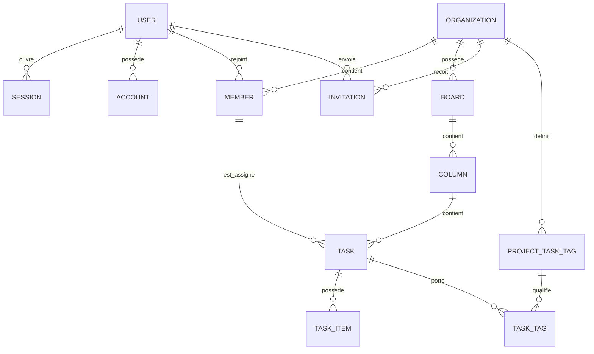

# OpenSprint - document source pour la certification CDA

Date de constitution : 26 mai 2026

Ce document rassemble les informations utiles pour produire ensuite le dossier projet CDA du projet OpenSprint. Il ne s'agit pas encore du dossier projet final : c'est une base de preuves, de contexte, de périmètre, de choix techniques et de modélisation à réutiliser.

## 1. Identité du projet

Nom du projet : OpenSprint

Type d'application : application web collaborative de gestion de projet agile, orientée Kanban.

Objectif général : permettre à des utilisateurs authentifiés de créer des espaces projet, d'organiser le travail en tableaux Kanban, de gérer des tâches, des membres, des rôles et des invitations.

Proposition de formulation courte :

> OpenSprint est une application web de pilotage de projets qui centralise les projets, les tableaux Kanban, les tâches, les affectations et la gestion des accès dans un espace sécurisé.

## 2. Contexte et problématique

Dans une équipe projet, les informations de suivi peuvent vite être dispersées entre différents outils : listes de tâches, conversations, tableaux informels, documents partagés. Cette dispersion rend le suivi des responsabilités, de l'avancement et des priorités moins lisible.

OpenSprint répond à ce besoin en proposant :

- un espace centralisé par projet ;
- un tableau Kanban organisé en colonnes ;
- une gestion des tâches avec priorité, type, échéance, estimation, assignation, checklist et tags ;
- une gestion des membres et des droits ;
- un système d'invitations ;
- une interface responsive et protégée par authentification.

## 3. Public cible

Utilisateurs principaux :

- chef de projet ou responsable d'équipe ;
- développeur ou membre d'une équipe produit ;
- administrateur de projet ;
- contributeur invité dans un projet.

Personas possibles pour le dossier :

- Owner de projet : crée un projet, configure le tableau, invite les membres, change les rôles.
- Admin de projet : gère les invitations, les membres non-owner et le suivi opérationnel.
- Membre : consulte le projet, déplace les tâches, met à jour son travail et suit les priorités.

## 4. Périmètre fonctionnel actuel

### Authentification

- Inscription par email et mot de passe.
- Connexion par email et mot de passe.
- Session utilisateur gérée avec Better Auth.
- Protection des routes dashboard/projet via proxy Next.js.

Pages concernées :

- `/sign-up`
- `/sign-in`
- `/dashboard`
- `/projects/:id`
- `/projects/:id/boards/:boardId`
- `/projects/:id/members`

### Gestion des projets

- Lister les projets accessibles à l'utilisateur.
- Créer un projet avec un nom, une description optionnelle et un nom de tableau par défaut.
- Générer un slug projet.
- Créer automatiquement le membre owner à la création du projet.
- Créer automatiquement un tableau par défaut.
- Créer automatiquement les colonnes par défaut :
  - Backlog ;
  - Active, limite WIP 5 ;
  - Review, limite WIP 3 ;
  - Done.
- Consulter un projet.
- Modifier un projet : nom, description, statut.
- Supprimer un projet.
- Filtrer et trier les projets dans le dashboard.

Statuts projet :

- active ;
- paused ;
- archived.

### Gestion des tableaux

- Lister les tableaux d'un projet.
- Créer un tableau.
- Consulter un tableau.
- Renommer un tableau.
- Supprimer un tableau.
- Naviguer entre plusieurs tableaux d'un projet.

### Gestion des colonnes Kanban

- Lister les colonnes d'un tableau.
- Créer une colonne.
- Modifier une colonne : nom, type, limite WIP, position.
- Supprimer une colonne.
- Réordonner les colonnes.

Types de colonnes :

- backlog ;
- active ;
- review ;
- done ;
- custom.

### Gestion des tâches

- Lister les tâches d'une colonne.
- Créer une tâche.
- Modifier une tâche.
- Supprimer une tâche.
- Déplacer une tâche dans une autre colonne.
- Réordonner une tâche dans une colonne.
- Transférer une tâche vers une colonne d'un autre projet accessible.
- Assigner ou désassigner une tâche à un membre du projet.
- Afficher les métriques du board : nombre de colonnes, tâches ouvertes, tâches assignées, alertes WIP.

Attributs principaux d'une tâche :

- titre ;
- description ;
- priorité ;
- type ;
- estimation ;
- position ;
- échéance ;
- assigné ;
- checklist ;
- tags.

Priorités :

- low ;
- medium ;
- high ;
- urgent.

Types de tâches :

- task ;
- bug ;
- feature ;
- chore.

### Checklists de tâches

- Ajouter un élément de checklist à une tâche.
- Modifier un élément.
- Cocher ou décocher un élément.
- Supprimer un élément.
- Réordonner les éléments.

### Tags de tâches

- Créer un tag au niveau projet avec nom et couleur.
- Modifier un tag.
- Supprimer un tag.
- Associer un tag à une tâche.
- Retirer un tag d'une tâche.

### Membres et rôles

Rôles :

- owner ;
- admin ;
- member.

Règles principales :

- le créateur du projet devient owner ;
- owner peut changer les rôles des membres admin/member ;
- owner ne peut pas être rétrogradé via la route de modification de membre ;
- admin et owner peuvent gérer les invitations ;
- member n'a pas accès aux actions d'administration des invitations ;
- un membre ne peut pas être manipulé hors de son projet ;
- l'accès projet nécessite une appartenance au projet.

### Invitations

- Lister les invitations reçues par l'utilisateur connecté.
- Lister les invitations d'un projet.
- Créer une invitation vers un utilisateur existant.
- Annuler une invitation.
- Accepter une invitation.
- Refuser une invitation.
- Normalisation des emails en minuscules.
- Expiration des invitations au bout de 7 jours.
- Prévention des doublons : une invitation pending unique par projet/email.
- Refus d'inviter un utilisateur déjà membre.

## 5. Hors périmètre actuel

Ces éléments peuvent être présentés comme limites ou évolutions futures :

- messagerie temps réel ;
- notifications email réelles pour les invitations ;
- commentaires de tâche ;
- pièces jointes ;
- calendrier global ;
- export PDF/CSV ;
- analytics avancées ;
- intégration GitHub/Jira/Slack ;
- application mobile native ;
- gestion multi-organisation avancée au-delà des projets actuels ;
- déploiement continu de production documenté dans le dépôt.

## 6. Stack technique

Frontend :

- Next.js 16 ;
- React 19 ;
- TypeScript ;
- Tailwind CSS 4 ;
- shadcn-style UI primitives dans `src/shared/ui` ;
- TanStack Query pour l'état serveur ;
- dnd-kit pour le drag and drop Kanban ;
- Tabler Icons et Lucide React pour les icônes.

Backend :

- Hono, monté sous `/api` ;
- TypeScript ;
- Zod pour la validation des entrées ;
- `@punpun-dev/ts-result` pour les retours métier `ok` / `err` ;
- Better Auth pour l'authentification ;
- Better Auth organization plugin côté auth client/server.

Base de données :

- PostgreSQL ;
- Drizzle ORM ;
- Drizzle Kit pour les migrations ;
- Docker Compose pour la base locale.

Qualité et tests :

- Vitest ;
- Testing Library React ;
- jsdom pour les tests frontend ;
- environnement Node pour les tests backend ;
- Biome pour le lint et le formatage ;
- TypeScript compiler pour le typecheck ;
- GitHub Actions pour la CI.

## 7. Architecture applicative

### Architecture globale

OpenSprint suit une architecture Next.js avec séparation frontend/backend dans le même dépôt.

- `src/app/` : routes Next.js, layouts et pages.
- `src/features/` : fonctionnalités frontend orientées workflow.
- `src/entities/` : entités métier frontend, API clients, hooks TanStack Query et types.
- `src/widgets/` : blocs d'interface composés, par exemple sidebar, header, Kanban board.
- `src/shared/` : composants UI, client API, helpers, hooks et utilitaires communs.
- `src/server/` : API Hono, contrôleurs, use cases, repositories, DB, auth.
- `src/server/db/schemas/` : schémas Drizzle auth et business.
- `drizzle/` : migrations générées.

### Architecture backend

Flux type d'une requête :

1. Page ou hook frontend appelle le client Hono typé.
2. La requête arrive dans un contrôleur Hono.
3. `guard()` vérifie la session utilisateur sur les routes protégées.
4. `validate("json", Schema)` valide les entrées avec Zod.
5. Le contrôleur appelle un use case.
6. Le use case applique les règles métier et les contrôles d'accès.
7. Le use case appelle un repository Drizzle.
8. Le résultat métier est renvoyé via `ok(...)` ou `err(...)`.
9. Le contrôleur mappe le résultat vers une réponse HTTP JSON.

### Organisation backend observée

Contrôleurs :

- `auth.controller.ts` : délégation à Better Auth.
- `health.controller.ts` : santé API.
- `project.controller.ts` : projets, boards, membres, invitations projet, tags projet.
- `column.controller.ts` : colonnes de board.
- `task.controller.ts` : tâches, affectations, déplacement, checklist, tags.

Use cases principaux :

- project : create, list, get, update, delete.
- board : create, list, get, update, delete, default columns.
- column : create, list, update, delete, reorder.
- task : create, list, update, delete, assign, move, transfer, reorder, items, tags.
- member : list, add, update, remove.
- invitation : create, list project, list user, accept, decline, cancel.

Repositories :

- projectRepository ;
- boardRepository ;
- columnRepository ;
- taskRepository ;
- taskItemRepository ;
- taskTagRepository ;
- memberRepository ;
- invitationRepository.

## 8. API REST/Hono

Base path : `/api`

### Santé

- `GET /api/health`

### Auth

Routes Better Auth déléguées :

- `GET /api/auth/*`
- `POST /api/auth/*`

### Projets

- `GET /api/projects`
- `POST /api/projects`
- `GET /api/projects/:id`
- `PATCH /api/projects/:id`
- `DELETE /api/projects/:id`

### Boards

- `GET /api/projects/:id/boards`
- `POST /api/projects/:id/boards`
- `GET /api/projects/:id/boards/:boardId`
- `PATCH /api/projects/:id/boards/:boardId`
- `DELETE /api/projects/:id/boards/:boardId`

### Colonnes

- `GET /api/projects/:id/boards/:boardId/columns`
- `POST /api/projects/:id/boards/:boardId/columns`
- `PATCH /api/projects/:id/boards/:boardId/columns/reorder`
- `PATCH /api/projects/:id/boards/:boardId/columns/:columnId`
- `DELETE /api/projects/:id/boards/:boardId/columns/:columnId`

### Tâches

- `GET /api/columns/:columnId/tasks`
- `POST /api/columns/:columnId/tasks`
- `PATCH /api/columns/:columnId/tasks/:taskId`
- `DELETE /api/columns/:columnId/tasks/:taskId`
- `PATCH /api/tasks/:taskId/assign`
- `PATCH /api/tasks/:taskId/move`
- `PATCH /api/tasks/:taskId/transfer`
- `PATCH /api/tasks/:taskId/reorder`

### Checklist

- `POST /api/tasks/:taskId/items`
- `PATCH /api/tasks/:taskId/items/reorder`
- `PATCH /api/tasks/:taskId/items/:itemId`
- `DELETE /api/tasks/:taskId/items/:itemId`

### Tags

- `GET /api/projects/:id/task-tags`
- `POST /api/projects/:id/task-tags`
- `PATCH /api/projects/:id/task-tags/:tagId`
- `DELETE /api/projects/:id/task-tags/:tagId`
- `POST /api/tasks/:taskId/tags`
- `DELETE /api/tasks/:taskId/tags/:tagId`

### Membres

- `GET /api/projects/:id/members`
- `POST /api/projects/:id/members`
- `PATCH /api/projects/:id/members/:memberId`
- `DELETE /api/projects/:id/members/:memberId`

### Invitations

- `GET /api/invitations`
- `POST /api/invitations/:invitationId/accept`
- `POST /api/invitations/:invitationId/decline`
- `GET /api/projects/:id/invitations`
- `POST /api/projects/:id/invitations`
- `DELETE /api/projects/:id/invitations/:invitationId`

## 9. Modèle de données

### Tables auth

`user`

- id, PK ;
- name ;
- email, unique ;
- emailVerified ;
- image ;
- createdAt ;
- updatedAt.

`session`

- id, PK ;
- expiresAt ;
- token, unique ;
- createdAt ;
- updatedAt ;
- ipAddress ;
- userAgent ;
- userId, FK vers user ;
- activeOrganizationId.

`account`

- id, PK ;
- accountId ;
- providerId ;
- userId, FK vers user ;
- accessToken ;
- refreshToken ;
- idToken ;
- accessTokenExpiresAt ;
- refreshTokenExpiresAt ;
- scope ;
- password ;
- createdAt ;
- updatedAt.

`verification`

- id, PK ;
- identifier ;
- value ;
- expiresAt ;
- createdAt ;
- updatedAt.

`invitation`

- id, PK ;
- organizationId, FK vers organization ;
- email ;
- role ;
- status ;
- inviterId, FK vers user ;
- expiresAt ;
- createdAt.

### Tables métier

`organization` utilisée comme projet

- id, PK ;
- name ;
- slug, unique ;
- logo ;
- metadata ;
- description ;
- status ;
- createdAt ;
- updatedAt.

`member`

- id, PK ;
- organizationId, FK vers organization ;
- userId, FK vers user ;
- role ;
- createdAt.

`board`

- id, PK ;
- projectId, FK vers organization ;
- name ;
- position ;
- createdAt ;
- updatedAt.

`column`

- id, PK ;
- boardId, FK vers board ;
- name ;
- kind ;
- wipLimit ;
- position ;
- createdAt ;
- updatedAt.

`task`

- id, PK ;
- columnId, FK vers column ;
- assigneeId, FK optionnelle vers member ;
- title ;
- description ;
- priority ;
- kind ;
- estimate ;
- position ;
- dueDate ;
- createdAt ;
- updatedAt.

`task_item`

- id, PK ;
- taskId, FK vers task ;
- title ;
- done ;
- position ;
- createdAt ;
- updatedAt.

`project_task_tag`

- id, PK ;
- projectId, FK vers organization ;
- name ;
- color ;
- createdAt ;
- updatedAt.

`task_tag`

- taskId, FK vers task ;
- tagId, FK vers project_task_tag ;
- clé primaire composée `(taskId, tagId)`.

## 10. Relations Merise candidates

Entités :

- UTILISATEUR ;
- SESSION ;
- COMPTE_AUTH ;
- PROJET ;
- MEMBRE ;
- INVITATION ;
- TABLEAU ;
- COLONNE ;
- TACHE ;
- ELEMENT_CHECKLIST ;
- TAG_PROJET ;
- ASSOCIATION_TACHE_TAG.

Relations et cardinalités :

- UTILISATEUR 1,N possède SESSION ; SESSION 1,1 appartient à UTILISATEUR.
- UTILISATEUR 1,N possède COMPTE_AUTH ; COMPTE_AUTH 1,1 appartient à UTILISATEUR.
- UTILISATEUR 0,N est MEMBRE ; MEMBRE 1,1 référence UTILISATEUR.
- PROJET 1,N possède MEMBRE ; MEMBRE 1,1 appartient à PROJET.
- PROJET 1,N possède TABLEAU ; TABLEAU 1,1 appartient à PROJET.
- TABLEAU 1,N possède COLONNE ; COLONNE 1,1 appartient à TABLEAU.
- COLONNE 1,N contient TACHE ; TACHE 1,1 appartient à COLONNE.
- MEMBRE 0,N peut être assigné à TACHE ; TACHE 0,1 est assignée à MEMBRE.
- TACHE 1,N possède ELEMENT_CHECKLIST ; ELEMENT_CHECKLIST 1,1 appartient à TACHE.
- PROJET 1,N définit TAG_PROJET ; TAG_PROJET 1,1 appartient à PROJET.
- TACHE 0,N est liée à TAG_PROJET via ASSOCIATION_TACHE_TAG.
- PROJET 1,N reçoit INVITATION ; INVITATION 1,1 concerne PROJET.
- UTILISATEUR 0,N envoie INVITATION ; INVITATION 1,1 est envoyée par UTILISATEUR.

### MCD Mermaid provisoire



## 11. Diagrammes UML à produire ensuite

### Diagramme de cas d'utilisation

Acteurs :

- Visiteur ;
- Utilisateur authentifié ;
- Membre de projet ;
- Administrateur de projet ;
- Owner de projet.

Cas d'utilisation :

- créer un compte ;
- se connecter ;
- consulter le dashboard ;
- créer un projet ;
- consulter un projet ;
- modifier un projet ;
- archiver ou supprimer un projet ;
- créer/renommer/supprimer un tableau ;
- créer/modifier/réordonner/supprimer une colonne ;
- créer/modifier/déplacer/réordonner/supprimer une tâche ;
- assigner une tâche ;
- gérer la checklist d'une tâche ;
- gérer les tags ;
- inviter un membre ;
- accepter/refuser une invitation ;
- modifier le rôle d'un membre ;
- retirer un membre.

### Diagrammes de séquence recommandés

Séquence 1 : création d'un projet

1. Utilisateur remplit le formulaire.
2. Frontend valide les champs.
3. Hook `useCreateProject` appelle `POST /api/projects`.
4. `guard()` vérifie la session.
5. Zod valide `CreateProjectInput`.
6. `CreateProjectUseCase` génère les IDs.
7. Repository crée le projet.
8. Repository crée le membre owner.
9. Repository crée le board par défaut.
10. Use case crée les colonnes par défaut.
11. Réponse JSON.
12. TanStack Query invalide/rafraîchit les projets.

Séquence 2 : création d'une tâche

1. Membre ouvre le formulaire de tâche.
2. Frontend envoie `POST /api/columns/:columnId/tasks`.
3. `guard()` vérifie la session.
4. Zod valide `CreateTaskInput`.
5. `CreateTaskUseCase` vérifie l'accès à la colonne.
6. Le use case vérifie l'assigné éventuel.
7. Le use case vérifie les tags éventuels.
8. Le repository calcule la position dans la colonne.
9. Le repository crée la tâche.
10. Les repositories créent checklist et liens de tags.
11. La tâche enrichie est renvoyée.

Séquence 3 : invitation d'un membre

1. Owner/admin saisit l'email et le rôle.
2. Frontend appelle `POST /api/projects/:id/invitations`.
3. `CreateInvitationUseCase` vérifie que l'utilisateur courant peut gérer les invitations.
4. Le use case normalise l'email.
5. Le use case vérifie que l'utilisateur cible existe.
6. Le use case vérifie qu'il n'est pas déjà membre.
7. Le use case vérifie qu'il n'y a pas d'invitation en attente.
8. Création de l'invitation avec expiration à 7 jours.

### Diagramme d'activité recommandé

Activité principale : gestion d'une tâche sur un tableau Kanban

- ouvrir un projet ;
- sélectionner un board ;
- choisir une colonne ;
- créer une tâche ou ouvrir une tâche existante ;
- renseigner titre, description, priorité, échéance, estimation ;
- assigner un membre ;
- ajouter checklist/tags ;
- déplacer la tâche selon son avancement ;
- vérifier les limites WIP ;
- terminer la tâche dans Done.

### Diagramme de classes candidat

Classes métier :

- User ;
- Project ;
- Member ;
- Board ;
- Column ;
- Task ;
- TaskItem ;
- ProjectTaskTag ;
- TaskTag ;
- Invitation ;
- Session ;
- Account.

Services/use cases :

- CreateProjectUseCase ;
- CreateTaskUseCase ;
- TransferTaskUseCase ;
- CreateInvitationUseCase ;
- AcceptInvitationUseCase ;
- UpdateMemberUseCase.

Repositories :

- ProjectRepository ;
- BoardRepository ;
- ColumnRepository ;
- TaskRepository ;
- MemberRepository ;
- InvitationRepository.

## 12. Sécurité

Mesures existantes :

- authentification avec Better Auth ;
- email/mot de passe activé ;
- mots de passe gérés par Better Auth dans la table `account.password` ;
- sessions persistées en base ;
- protection des routes dashboard/projets par `proxy.ts` ;
- routes API protégées par `guard()` ;
- contrôle d'appartenance projet dans les use cases ;
- contrôle des rôles pour la gestion des membres et invitations ;
- validation des entrées avec Zod ;
- requêtes base via Drizzle ORM plutôt que SQL manuel ;
- variables sensibles via `.env` ;
- secrets CI définis comme variables d'environnement GitHub Actions dans le workflow ;
- prévention des invitations dupliquées par index unique partiel ;
- expiration des invitations.

Points à documenter ou renforcer dans le dossier :

- expliquer le modèle RBAC owner/admin/member ;
- expliquer la protection contre les accès directs non autorisés ;
- expliquer la validation serveur systématique ;
- mentionner que les secrets ne doivent pas être versionnés ;
- mentionner les limites actuelles : pas encore de politique avancée de rate limiting visible dans le dépôt, pas de tests E2E sécurité dédiés.

## 13. Accessibilité et UX

Eléments observés :

- interface responsive avec Tailwind ;
- composants UI shadcn-style ;
- navigation principale via sidebar ;
- header contextuel ;
- boutons avec icônes ;
- labels et erreurs dans les formulaires ;
- `sr-only` utilisé sur certaines actions iconiques ;
- états de chargement via `LoadingScreen` ;
- feedback utilisateur via `sonner` toasts ;
- tableaux pour la gestion des membres et invitations ;
- filtres et tri dans le dashboard.

Points à préparer pour le dossier :

- captures desktop/tablette/mobile ;
- score Lighthouse accessibilité si possible ;
- exemple de formulaire avec erreurs ;
- justification de l'ergonomie Kanban ;
- justification de la séparation dashboard / board / members.

## 14. Tests

Le projet contient 46 fichiers de tests.

Organisation :

- tests backend dans `src/test/server/**/*.test.ts` ;
- tests frontend dans `src/**/*.test.ts(x)` hors `src/server` et `src/test/server` ;
- setup backend : `src/test/setup/backend.ts` ;
- setup frontend : `src/test/setup/frontend.ts` ;
- factories et helpers : `src/test/`.

Commandes :

- `pnpm run test` : tous les tests ;
- `pnpm run test:backend` : tests backend ;
- `pnpm run test:frontend` : tests frontend ;
- `pnpm run test:coverage` : couverture ;
- `pnpm run lint` : lint Biome ;
- `pnpm run check` : Biome check avec écriture ;
- `pnpm exec tsc --noEmit` : typecheck utilisé dans la CI.

Périmètres testés observés :

- API entités frontend : project, board, column, task, member, invitation ;
- hooks TanStack Query ;
- formulaires d'authentification ;
- formulaires création/édition projet, colonne, tâche ;
- composants de dashboard/header/sidebar ;
- Kanban drag and drop ;
- use cases serveur project, board, column, task, member, invitation ;
- middleware/proxy ;
- serveur Hono.

Jeux de tests à formaliser pour le dossier :

- test unitaire : validation d'un formulaire ou helper ;
- test d'intégration backend : création projet avec board et colonnes par défaut ;
- test d'intégration backend : invitation membre avec contrôle de rôle ;
- test frontend : affichage/interaction du tableau Kanban ;
- test de sécurité : accès refusé à un projet dont l'utilisateur n'est pas membre ;
- test d'acceptation : scénario complet créer projet -> créer tâche -> déplacer tâche -> inviter membre.

## 15. CI/CD et DevOps

CI existante : `.github/workflows/ci.yml`

Déclencheurs :

- push sur `main` ;
- pull request vers `main`.

Jobs :

- `lint-and-typecheck` :
  - checkout ;
  - pnpm setup ;
  - Node 22 ;
  - `pnpm install --frozen-lockfile` ;
  - `pnpm check` ;
  - `pnpm exec tsc --noEmit`.
- `frontend-tests` :
  - installation ;
  - `pnpm test:frontend`.
- `backend-tests` :
  - service PostgreSQL 17 Alpine ;
  - migrations Drizzle ;
  - `pnpm test:backend`.

Base de données locale :

- Docker Compose lance PostgreSQL 17 Alpine ;
- port local 5432 ;
- volume persistant `db_data`.

Commandes DB :

- `pnpm run db:up` ;
- `pnpm run db:down` ;
- `pnpm run db:clean` ;
- `pnpm run db:generate` ;
- `pnpm run db:migrate`.

Point important pour le dossier :

- Le dépôt démontre une intégration continue complète.
- Le déploiement continu de production n'est pas visible dans le dépôt actuel. Il faudra soit documenter un déploiement réel si existant ailleurs, soit le présenter comme évolution/limite.

## 16. Environnement et installation

Prérequis :

- Node.js compatible Next.js 16 ;
- pnpm ;
- Docker pour PostgreSQL local ;
- variable `DATABASE_URL` obligatoire ;
- `BETTER_AUTH_SECRET` ;
- `BETTER_AUTH_URL` ;
- éventuellement `NEXT_PUBLIC_APP_URL`.

Installation locale type :

```bash
pnpm install
pnpm run db:up
pnpm run db:migrate
pnpm run dev
```

Build :

```bash
pnpm run build
pnpm run start
```

## 17. Sources de code importantes

Architecture :

- `src/server/index.ts`
- `src/app/(api)/api/[...route]/route.ts`
- `src/server/lib/auth.ts`
- `src/proxy.ts`
- `src/shared/lib/api/client.ts`

Schémas DB :

- `src/server/db/schemas/auth/*.ts`
- `src/server/db/schemas/business/*.ts`
- `src/server/db/lib/relations.ts`

Contrôleurs :

- `src/server/controllers/lib/project.controller.ts`
- `src/server/controllers/lib/column.controller.ts`
- `src/server/controllers/lib/task.controller.ts`
- `src/server/controllers/lib/invitation.controller.ts`
- `src/server/controllers/lib/auth.controller.ts`

Use cases :

- `src/server/use-cases/project/lib/create-project.ts`
- `src/server/use-cases/board/lib/default-columns.ts`
- `src/server/use-cases/task/lib/create-task.ts`
- `src/server/use-cases/task/lib/transfer-task.ts`
- `src/server/use-cases/invitation/lib/create-invitation.ts`
- `src/server/use-cases/invitation/lib/respond-to-invitation.ts`
- `src/server/use-cases/member/lib/update-member.ts`

Frontend :

- `src/app/(index)/page.tsx`
- `src/app/(dashboard)/dashboard/page.tsx`
- `src/app/(dashboard)/projects/[id]/boards/[boardId]/page.tsx`
- `src/app/(dashboard)/projects/[id]/members/page.tsx`
- `src/widgets/kanban-board/`
- `src/features/manage-task/`
- `src/features/create-project/`
- `src/features/create-column/`
- `src/features/create-task/`
- `src/features/auth/`

CI :

- `.github/workflows/ci.yml`

## 18. Traçabilité avec les compétences CDA

### Développer une application sécurisée

Compétences couvertes :

- installation et configuration de l'environnement : Next.js, pnpm, Docker, PostgreSQL, Drizzle, Better Auth ;
- interfaces utilisateur : landing page, auth, dashboard, Kanban, membres, formulaires ;
- composants métier : projets, tableaux, colonnes, tâches, invitations, rôles ;
- gestion de projet : historique Git, branches observées, CI, tests.

### Concevoir et développer une application sécurisée organisée en couches

Compétences couvertes :

- analyse des besoins : application de gestion de projet agile ;
- architecture logicielle : Next.js + Hono + use cases + repositories + Drizzle ;
- base de données relationnelle : PostgreSQL, schémas Drizzle, relations ;
- accès aux données : repositories, ORM, migrations ;
- sécurité : auth, guard, RBAC, validation Zod.

### Préparer le déploiement d'une application sécurisée

Compétences couvertes :

- tests frontend/backend ;
- CI GitHub Actions ;
- migrations DB en CI ;
- Docker Compose pour l'environnement local ;
- documentation des commandes.

Points à compléter si demandé par le jury :

- procédure de déploiement production ;
- URL publique ;
- stratégie de rollback ;
- journal d'incident ou de bug ;
- preuve de run CI vert récent ;
- captures de tests et couverture.

## 19. User stories candidates

US-01 : En tant que visiteur, je veux créer un compte afin d'accéder à mon espace projet.

US-02 : En tant qu'utilisateur, je veux me connecter afin de retrouver mes projets.

US-03 : En tant qu'utilisateur connecté, je veux créer un projet afin de centraliser le suivi d'une équipe.

US-04 : En tant que membre, je veux consulter la liste de mes projets afin d'accéder rapidement au bon espace.

US-05 : En tant que membre, je veux consulter un board Kanban afin de visualiser l'avancement des tâches.

US-06 : En tant que membre, je veux créer une tâche afin de formaliser un travail à réaliser.

US-07 : En tant que membre, je veux déplacer une tâche entre les colonnes afin de représenter son avancement.

US-08 : En tant que membre, je veux ajouter une checklist à une tâche afin de découper le travail.

US-09 : En tant que membre, je veux assigner une tâche à un membre afin de clarifier la responsabilité.

US-10 : En tant qu'admin ou owner, je veux inviter un membre afin de collaborer sur un projet.

US-11 : En tant qu'utilisateur invité, je veux accepter ou refuser une invitation afin de contrôler mon accès au projet.

US-12 : En tant qu'owner, je veux modifier le rôle d'un membre afin d'adapter les permissions.

US-13 : En tant que membre, je veux filtrer et trier mes projets afin de retrouver rapidement un projet.

US-14 : En tant que membre, je veux utiliser des tags afin de catégoriser les tâches.

US-15 : En tant qu'équipe, nous voulons des limites WIP visibles afin d'identifier la surcharge d'une colonne.

## 20. Scénarios d'acceptation candidats

Scénario A : création de projet

- Given un utilisateur authentifié ;
- When il crée un projet avec un nom et un board par défaut ;
- Then le projet existe ;
- And il devient owner ;
- And un board par défaut existe ;
- And les colonnes Backlog, Active, Review et Done sont créées.

Scénario B : création de tâche

- Given un membre d'un projet ;
- And une colonne accessible ;
- When il crée une tâche avec un titre, une priorité et une checklist ;
- Then la tâche est ajoutée en dernière position de la colonne ;
- And les éléments de checklist sont créés ;
- And la tâche apparaît dans le board.

Scénario C : invitation

- Given un owner ou admin ;
- And un utilisateur cible existant ;
- When il crée une invitation ;
- Then l'invitation est pending ;
- And elle expire dans 7 jours ;
- And une invitation pending dupliquée est refusée.

Scénario D : contrôle d'accès

- Given un utilisateur non membre du projet ;
- When il tente d'accéder aux ressources du projet ;
- Then l'API renvoie une erreur d'autorisation ;
- And aucune donnée projet n'est exposée.

## 21. Risques, limites et évolutions

Risques identifiés :

- besoin de prouver le déploiement si la certification exige une mise en production réelle ;
- besoin de captures et preuves visuelles pour le dossier final ;
- besoin de vérifier la couverture exacte des tests au moment de finaliser le dossier ;
- Better Auth masque une partie du détail d'implémentation du hachage des mots de passe, il faudra l'expliquer comme choix de bibliothèque éprouvée ;
- la table `organization` est utilisée comme table projet, il faudra expliquer ce choix lié au plugin Better Auth.

Evolutions pertinentes :

- notifications email pour invitations ;
- commentaires de tâches ;
- pièces jointes ;
- audit log ;
- exports ;
- mode temps réel ;
- déploiement continu complet ;
- monitoring et logs applicatifs ;
- tests E2E avec Playwright.

## 22. Eléments à collecter avant rédaction finale du dossier projet

- captures d'écran de la landing page ;
- captures inscription/connexion ;
- capture dashboard avec projets ;
- capture création projet ;
- capture board Kanban ;
- capture création/édition tâche ;
- capture gestion membres ;
- capture invitations ;
- capture CI GitHub Actions verte ;
- capture couverture de tests si disponible ;
- URL publique si déployée ;
- dates de réalisation ;
- nom du candidat ;
- contexte réel : projet personnel, formation, entreprise ou autre ;
- difficultés rencontrées ;
- choix alternatifs envisagés ;
- veille technologique personnelle ;
- procédure de déploiement réelle si disponible.

